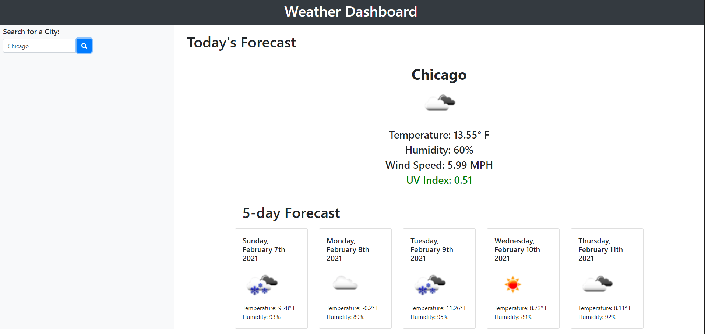

Weather Near You 

Welcome to Weather Near You! 

This webpage lets you access the weather in any city of the USA. Just type the name of the city in the search bar and you will see:

<ul>
<li>The name of the city you searched for</li>
<li>An icon representation of the current weather state</li>
<li>The current temperature</li>
<li>The current humidity percentage</li>
<li>The current wind speed in MPH</li>
<li>The current UV Index. (NOTE: the UV index text will change color based on if it is high, moderate, or low for that day.)</li>
</ul>

You will also be presented with a 5 day forecast including:
<ul>
<li>The date of the predeicted forecast</li>
<li>An icon representation of the weather state</li>
<li>The temperature for that day</li>
<li>The humidity percentage for that day</li>
</ul>

 
 
Associated links:
 
 https://ashley-ag.github.io/WeatherNearYou/ 
 
 https://github.com/ashley-ag/WeatherNearYou
 
 
 
 

